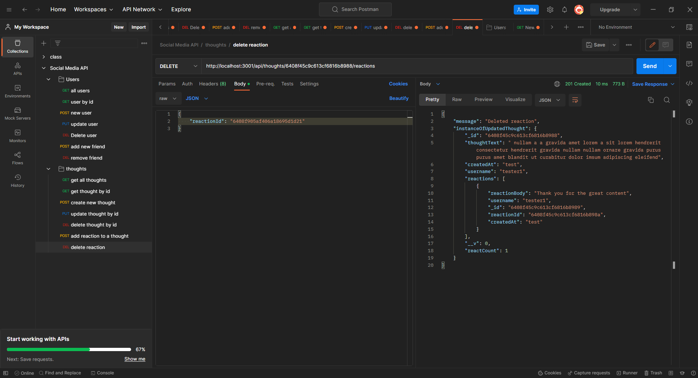

# Social Media API

## Description

Welcome to the social media API! This api is designed for a social media appliation to store and query its data. The Social Media API will help handle all of the information needed for a social media app. Mongoose and MongoDB were used heavily for this project. 

## Table of Contents
 - [Usage](#usage)
 - [Credits](#credits)
 - [License](#license)
 - [Questions](#questions)

## Usage

To use this application, you can use an api testing platform or query through browser. The video above shows how to query and some of the results from the possible queryies.

## Credits

Creator: Gustavo Carrillo

## License

This project is under the MIT License

## Questions
     
Please contact me through the following

 - [GitHub Profile](https://github.com/0zrk23)
 - [Email](gus.carrillo1221@gmail.com)